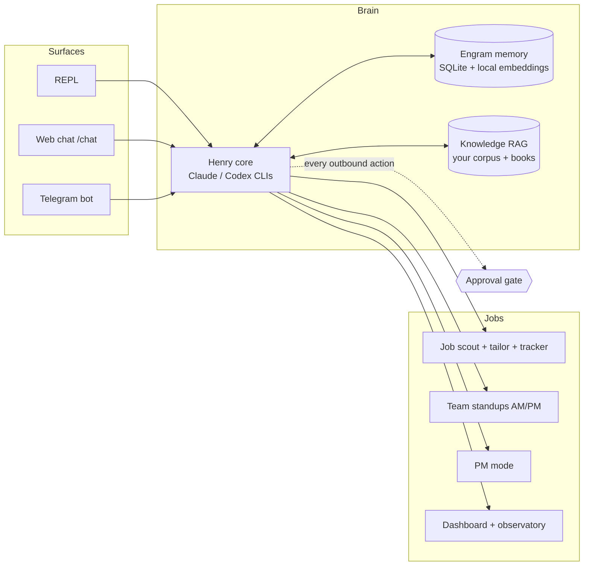

# Kelly — a Codex-only quotation agent for electrical shops

> Kelly's current product documentation is in [KELLY_README.md](KELLY_README.md).
> The material below documents the shared Henry runtime Kelly is built on. It does
> not mean Kelly loads Henry's Gmail, career, social, or personal-data modules.

> **Setting it up? → [SETUP.md](SETUP.md).** It is written for an AI
> coding agent to execute — clone this repo, hand your Claude Code or
> Codex CLI the link, and it will walk you through install, provider auth
> (Claude *or* Codex — you only need the one you have), and the smoke
> tests. A ten-line human quick path and the real troubleshooting list
> are in the same file.
>
> **Want to understand and customize it? → [Open the Henry Handbook](docs/handbook/index.html).**
> It takes you from a blank clone to your own persona, first working run,
> private knowledge base, Telegram surface, automation, and custom module.

After cloning, open the repository in Codex CLI, Claude Code, or Gemini CLI and
paste this:

```text
Set up this repository as Kelly, the electrical-shop quotation agent. Read
AGENTS.md, CLAUDE.md, KELLY_README.md, SETUP-PROMPT.md, SETUP.md, and BOOTSTRAP.md
completely before changing anything. Follow the fresh-clone setup flow: ask me for
the shop's problem statement and users, research the workflow, and recommend a
blueprint for catalogue import, quotation, approvals, and data boundaries. Ask me
to correct it before implementation. Then interview me for identity, personality,
memory, and authority choices; configure Kelly for Codex only; run the repository
checks; and hand me a working local setup. Never send anything, approve anything
for me, expose the dashboard remotely, or commit private data.
```

Henry is a terminal-first personal agent framework: one brain (Claude/Codex CLIs +
a local memory engine) behind **three chat surfaces** — terminal REPL, a streaming
web chat, and Telegram — with real jobs wired in: job-hunt automation, team
standups, scheduled pipelines, and a hard **approval gate** so nothing outbound
ever leaves without the operator's explicit yes. Local-first: SQLite memory,
on-device embeddings, $0 marginal cost on an 8GB M1 Air.



## What Henry does

| | |
| --- | --- |
| 🧠 **Remembers** | Hybrid memory (semantic + lexical + activation graph), nightly consolidation, per-person style profiles |
| 📚 **Learns your corpus** | Index courses, notes, and books you own into a cited, coverage-labeled RAG ([guide](docs/build-your-own-knowledge-rag.md) · [books](build-your-pm-brain.md)) |
| 💼 **Runs your job hunt** | Morning scout (LinkedIn + X shortlist), one-page tailored resume + cover letter per JD, inbox watch, application tracker + Telegram digests. It can also fill a real application form in a browser and submit it — only for an application you approved, and filling and submitting are two separate approvals |
| 👥 **Runs team standups** | Telegram group bot: morning plans + evening delivered-vs-planned, style-matched nudges, summaries to your DM |
| 📋 **Acts as a PM** | `pm on`: PMBOK-grounded decisions with explicit rationale, update processing, gated work assignment |
| 🌙 **Dispatches deep research** | Long research asks acknowledge immediately, run through Luna's read-only research specialist, remain visible in the agent registry, and report back when complete |
| 🔒 **Never freelances outbound** | Email/comments/applications are staged; `approve` ≠ `send`; scope-guarded Telegram surfaces |

## Chat with it — including from your phone

Terminal: `henry repl` · Web: `henry dashboard` → `http://127.0.0.1:7337/chat` ·
**Telegram**: your agent walks you through it — ask it to "set up telegram", and it
gives you the BotFather steps, wires your token + chat id into `.env` itself, and
verifies with a test message. Full instructions: [docs/modules/telegram.md](docs/modules/telegram.md).

## Quick start (or let your own agent do it)

Fastest: open this repo in Claude Code / Codex CLI and paste the block from
**[BOOTSTRAP.md](BOOTSTRAP.md)** — it interviews you, builds your persona from the
example templates, and verifies each step. By hand:

```bash
npm install
cp .env.example .env        # then soul.example.md → soul.md, personality.example.md → personality.md
npm run typecheck && npm test
npm link                    # installs the global `henry` command
npx tsx src/cli.ts repl
```

## Common commands

```bash
henry ask "summarize the current git changes"
henry repl                      # chat + dashboard + schedules, all alive in one terminal
henry pm on                     # project-manager mode
henry draft replies --limit 5   # reads unread mail and creates Gmail drafts only—never sends
henry draft mail --to you@example.com --subject "Hello" --body "…"  # approval-gated
henry jobs login && henry jobs scout --prepare 2
henry jd --file posting.txt     # tailored one-page resume + cover letter
henry standup discover          # wire your team's Telegram group
henry knowledge add <path> --domain project-management
henry memory search "what did we decide about deploys?"
henry approve list && henry approve send <approval-id>
henry schedule daemon           # or: schedule install (launchd)
henry pr review 123 --repo owner/repository
henry pr merge 123 --repo owner/repository --check "npm test" --verify "npm run build"
```

PR review runs six engineering passes. PR merges are pinned to the reviewed commit,
approval-gated, and followed by the supplied verification command. If verification
fails, Henry stages a separate approval for a GitHub revert PR. See
[docs/modules/pr-review.md](docs/modules/pr-review.md).

## The safety boundary

Providers run with full local access; **outbound is different**. Every email,
comment, or application is drafted, staged, and shown for review — execution
happens only after the operator explicitly approves that exact item. Telegram
sends are pinned to two configured chats (operator DM + standup group) and can
never address anyone else.

## Make it yours

`BOOTSTRAP.md` (agent-executable setup) · [`SETUP-PROMPT.md`](SETUP-PROMPT.md) ·
[`docs/rename-your-agent.md`](docs/rename-your-agent.md) ·
[`docs/connector-architecture.md`](docs/connector-architecture.md) ·
`docs/build-your-own-knowledge-rag.md` ·
`build-your-pm-brain.md` · `docs/architecture.md` · `docs/modules/` (per-module
agent-facing docs). Personal data (soul, memory, corpus, `data/`) is gitignored —
the framework ships, your life doesn't.

## License

MIT — see [LICENSE](LICENSE). Copyright (c) 2026 Luvish Gulati.
