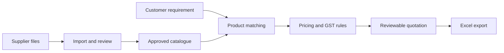

# Kelly

Kelly is a locally running business agent for small teams in India.

It is designed for businesses where the owner still handles repetitive work by
hand: preparing quotations, answering the same customer questions, checking
catalogues, updating spreadsheets, and following up on routine tasks. Kelly turns
those workflows into reliable tools that can be adapted to each business.

Quotation is the first complete workflow, and hands-free voice on a counter
tablet is the primary interface today, alongside the terminal, dashboard, and
Telegram.

## Why Kelly exists

Small businesses rarely need another generic chatbot. They need an agent that
understands their products, follows their pricing rules, works with the files they
already use, and keeps business data under their control.

Kelly runs locally, learns from approved business material, and separates facts
from generated language. It can search a catalogue conversationally, but totals,
discounts, taxes, and final quotation values are calculated in code.

Kelly serves two trades today, an electrical shop and a ladies' boutique, one
trade per install. The trade is chosen once at setup (`KELLY_TRADE`) and does
not switch at runtime; each deployment stays one shop, one line of business.

### Try the boutique demo

```bash
kelly start --demo --trade boutique
```

This seeds an isolated demo rate card and placeholder design photos for a
fictional ladies' boutique, and never touches real owner data. It needs the
local voice stack from [SETUP.md](SETUP.md) section 5. Open the dashboard it
prints, then look at the switchboard, the Designs pane, and the Talk page. Try
asking:

- "show me trending sarees"
- "how much for two salwar suits with lining, my own fabric, needed by Friday"

## What works today

- Hands-free voice on a counter tablet (the Talk page): the customer or staff
  speaks, Kelly answers out loud, understanding English, Hindi, Hinglish, and
  Roman Hindi while always answering in clear English
- Two trade packs, one per install: an electrical shop (multi-brand product
  quotations) and a ladies' boutique (stitching rate card, quotations, and a
  customer-facing design gallery)
- Rate cards and catalogues imported from PDF, XLSX, and CSV files, reviewed
  before publishing to search
- Quotations computed in code, never estimated by a model: matching items
  across brands and categories, discounts and GST applied deterministically,
  and totals in Indian rupees
- Export quotations to Excel
- Inspect, search, and safely edit spreadsheets through a local Excel connector
- A design gallery with a glass slideshow customers can browse by voice or tap
- Remember owner preferences and recurring corrections
- Learn from previous questions without mixing one customer's context with another
- Run through the terminal, the local web dashboard, Telegram, or a voice
  counter tablet
- An optional public link on your own domain (Cloudflare or Tailscale Funnel),
  locked behind an account password
- Schedule reminders and routine checks

## Where Kelly can go next

Kelly is built around business workflows, not one industry. A deployment can be
adapted for:

- customer support grounded in company documents
- product discovery and guided selling
- order intake and follow-up
- service booking and status updates
- stock and catalogue questions

These are extension paths, not claims about the current release. The present build
has the deepest support for catalogue search, quotations, the voice counter,
spreadsheets, and local business memory.

## Roadmap

Planned, not built:

- Web image search fallback when a boutique deployment's design gallery has no match
  for a requested category — owner-approved sources only, results shown labeled as
  external, never saved without the owner's explicit yes.
- Try-on image generation ("how would this design look on her") from a customer photo —
  needs explicit consent and local-only storage rules.
- CLIP image embeddings for search-by-photo, once a deployment's designs store exists.

## How quotation works



The language model helps understand requests and retrieve likely products. The
catalogue remains the source of truth. Ambiguous matches stay unresolved until a
person reviews them.

## Quick start

Setting Kelly up for a real shop? Open Claude Code or Codex inside a fresh clone
and say "set this up for my shop". The agent follows
[SETUP-PROMPT.md](SETUP-PROMPT.md) and [SETUP.md](SETUP.md): it asks about the
shop, installs the voice stack, imports the price list, creates the logins, and
gets the counter tablet talking.

By hand, on macOS with Apple Silicon, Node 22 or newer, and a Codex login:

```bash
git clone https://github.com/Luvishgulati03/kelly.git ~/kelly && cd ~/kelly
npm install
cp KELLY.env.example .env && chmod 600 .env     # set KELLY_TRADE and KELLY_SHOP_NAME
# second Kelly on this Mac? also set KELLY_DATA_DIR and KELLY_MEMORY_DIR first (SETUP.md step 4)
cp soul.example.md soul.md
cp personality.example.md personality.md
codex login
brew install whisper.cpp ffmpeg python@3.12
# download the three speech models and create the Python venv: SETUP.md section 5
node bin/kelly.mjs users add owner --role admin
node bin/kelly.mjs users add counter --role counter
node bin/kelly.mjs start
```

The dashboard runs at `http://127.0.0.1:7338` and the local speech worker at
`127.0.0.1:8765`. A tablet reaches Kelly through a tunnel
(`kelly start --public ...`, see [SETUP.md](SETUP.md) section 11). Run Kelly
commands from the repository root.

## Useful commands

```bash
kelly repl
kelly dashboard
kelly ask "Find ceiling fans under ₹3,000"

kelly catalogue import ./supplier-list.xlsx --sheet Products
kelly catalogue review
kelly catalogue publish <document-id>
kelly catalogue search "20W LED batten" --brand Havells

kelly quote create --from ./quote-request.json
kelly quote compare --from ./requirements.json --brands Havells,Philips
kelly quote export <quote-id> --out ./customer-quote.xlsx

kelly sheets inspect ./catalogue.xlsx
kelly sheets search ./catalogue.xlsx --query "ceiling fan"
kelly sheets edit ./catalogue.xlsx --edits ./edits.json --out ./catalogue-v2.xlsx
```

## Data and memory

Kelly keeps different kinds of knowledge separate:

| Layer | Purpose |
| --- | --- |
| Approved catalogue | Product facts, prices, brands, specifications, and source records |
| Business knowledge | Policies, FAQs, service details, and material supplied by the owner |
| Owner memory | Preferences, corrections, and durable operating decisions |
| Customer conversation memory | Previous questions and answers, isolated by customer |

Previous answers are hints, not authority. Current catalogue records, pricing
rules, and verified business documents always win.

## Safety and control

- Source catalogues are never overwritten.
- Spreadsheet edits are saved to a new file.
- Imported records require review before publication.
- Customer conversation stores are isolated.
- Outbound actions remain staged until the owner approves the exact action.
- The dashboard binds to the local machine unless secure remote access is
  explicitly configured.

## Product direction

Kelly's long-term interface is voice. A shop owner or staff member should be able
to ask for a quote, compare alternatives, answer a customer, or update a routine
record without learning a new back-office tool. The same workflow remains
available through web, Telegram, and terminal for review and control. The local
speech baseline under evaluation is quantized multilingual Whisper for
Hindi/English transcription and Kokoro-82M for English speech output; Hinglish shop-audio
quality has not yet been benchmarked. See [Voice](docs/voice.md) for model,
privacy, hardware, and setup notes.
The desktop's built-in Codex voice feature is not verified as an embeddable
Kelly interface; Kelly's documented voice path is its local CLI and dashboard.

## License

MIT. See [LICENSE](LICENSE).
